# Module 2 — Analytics Pipeline (`/analytics`)

Titanic survival: profiling, cleaning, a visual data story, and a full **classification** modeling pipeline,
followed by a fare-regression side task. It is one continuous pipeline:

```
01_eda.ipynb ──(saves titanic.csv)──> 02_modeling.ipynb ──> models/titanic_survival_pipeline.joblib
 load once, profile, clean,            read the same CSV, stratified split, sklearn Pipeline,
 EDA story, z-score check              3 classifiers, imbalance, GridSearchCV, regression, save
```

## How to run

From the repository root, inside the virtual environment described in the [root README](../README.md):

```bash
pip install -r analytics/requirements.txt
cd analytics
jupyter nbconvert --to notebook --execute --inplace 01_eda.ipynb       # or open and "Run All" in Jupyter
jupyter nbconvert --to notebook --execute --inplace 02_modeling.ipynb
```

Run them in order: `01_eda.ipynb` creates `titanic.csv`, which `02_modeling.ipynb` reads. Both notebooks are
committed **with their outputs**, so they can be read on GitHub without running anything.

## Files

| File | Purpose |
|---|---|
| `01_eda.ipynb` | Part A: the **only** `sns.load_dataset('titanic')` call, profiling, missing values, univariate / bivariate / multivariate analysis, and the z-score check |
| `02_modeling.ipynb` | Part B: split, pipeline, 3 classifiers, metrics, imbalance, tuning, regression, comparison, and saving plus reloading the model |
| `titanic.csv` | The committed offline fallback, saved right after loading (`df.to_csv("titanic.csv", index=False)`) |
| `models/titanic_survival_pipeline.joblib` | The complete fitted best pipeline (preprocessing + tuned Random Forest) |
| `figures/*.png` | Charts saved by the notebooks. These are supporting artifacts only; every interpretation is written below. |

**Loaded exactly once.** `01_eda.ipynb` calls `sns.load_dataset('titanic')` a single time and immediately
saves `titanic.csv`. If the internet is unreachable, it falls back to reading that committed CSV instead.
`02_modeling.ipynb` only ever reads `titanic.csv`; it never calls the seaborn loader.

---

# Part A — Profiling, cleaning and the data story

## 1. Profile

Shape **(891, 15)**. `df.info()`, `df.describe()` and the full missing-value table are printed in the notebook.

| Column | Missing % | Missing rows |
|---|---|---|
| `deck` | 77.22 | 688 |
| `age` | 19.87 | 177 |
| `embarked` | 0.22 | 2 |
| `embark_town` | 0.22 | 2 |

**Profile summary.**

- **Size and types.** 891 passengers × 15 columns: 6 numeric (`survived`, `pclass`, `age`, `sibsp`, `parch`,
  `fare`), 2 boolean flags (`adult_male`, `alone`), and text or categorical columns (`sex`, `embarked`, `class`,
  `who`, `deck`, `embark_town`, `alive`).
- **Missing values.** Four columns have gaps: **`deck` 77.22 %** (688 rows), **`age` 19.87 %** (177 rows),
  **`embarked` 0.22 %** (2 rows) and **`embark_town` 0.22 %** (2 rows).
- **Target balance.** **61.6 % did not survive and 38.4 % survived.** This moderate imbalance matters later
  for the stratified split and for the imbalance experiment.
- **Redundant columns.** `class`, `who`, `alive` and `embark_town` are re-encodings of `pclass`,
  `sex`/`age`, `survived` and `embarked`. `alive` in particular is simply the target in words.

## 2. Missing values — threshold rule

**Missing-value decisions, one per affected column, following the threshold rule:**

| Column | Measured missing | Band | Strategy |
|---|---|---|---|
| `embarked` | **0.22 %** (2 rows) | under 5 % | **Drop those rows** |
| `embark_town` | **0.22 %** (2 rows) | under 5 % | **Drop those rows**. They are the same 2 passengers as `embarked`, so only 2 rows are removed in total (891 → 889). |
| `age` | **19.87 %** (177 rows) | 5 %–30 % | **Impute** with the median age of the passenger's own `sex` × `pclass` group |
| `deck` | **77.22 %** (688 rows) | far above 30 % | **Encode "Unknown" as its own category** |

**Why group medians for `age`.** Age differs a lot between groups. The group medians range from 21.5
(third-class women) to 40.0 (first-class men). One global median (28) would pull every group towards the
middle; the group median keeps each passenger's likely age realistic. The median rather than the mean is used
because age is right-skewed.

**Why keep `deck` as "Unknown" instead of dropping the column.** With 77 % missing, any imputed deck letter would
be mostly invented, so imputation is ruled out. But the missingness itself is **informative**:

- Survival is **66.7 %** for passengers with a known deck, against **29.9 %** when the deck is unknown.
- An unknown deck is concentrated in the lower classes: 19.2 % of 1st class, 91.3 % of 2nd class and 97.6 % of
  3rd class.

In other words, "no recorded cabin" is a signal in itself, because cabin records mostly survived for
first-class passengers. Dropping the column would throw that signal away, while an explicit "Unknown" category
keeps it without inventing values.

## 3. Univariate analysis — `age` and `fare`

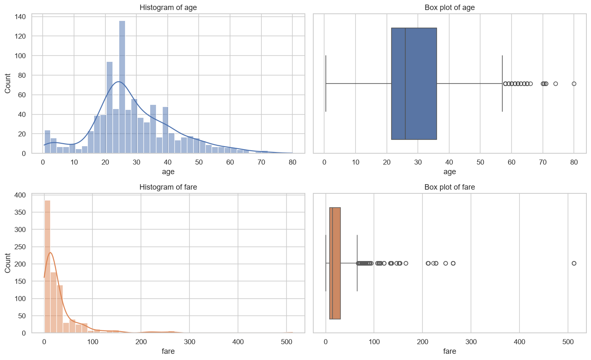

| Column | Q1 | Q3 | IQR | Fences | IQR outliers |
|---|---|---|---|---|---|
| `age` | 21.5 | 36.0 | 14.5 | [−0.25, 57.75] | **32** (3.6 %); 11 on the raw, un-imputed data |
| `fare` | 7.9 | 31.0 | 23.1 | [−26.76, 65.66] | **114** (12.8 %); 116 on the raw data |

**Univariate findings.**

- **`age`.** A single peak in the 20s, with a smaller bump of young children. The spike near 25 is partly
  created by the group-median imputation, which gave 177 passengers one of six median values.
  - IQR fences: [−0.25, 57.75]. **32 outliers (3.6 %)**, all elderly passengers above 57.75.
  - Measured before imputation, the same rule finds **11**. Imputation piles values into the middle, which
    narrows the IQR and so flags more of the older passengers.
  - These are genuine ages, not errors, so they are kept.
- **`fare`.** IQR fences: [−26.76, 65.66]. **114 outliers (12.8 %)** on the cleaned data (116 on the raw data),
  all expensive tickets. They are real first-class fares, up to 512.33, so they are kept as well.
- **Skewness of `fare`.** **mean (32.10) > median (14.45) > mode (8.05)**, which is the textbook ordering of a
  **right-skewed** distribution. A long tail of a few very expensive tickets pulls the mean far above the typical
  fare, while the most common ticket is a cheap third-class fare. The sample skewness of 4.80 confirms it.

## 4. Bivariate analysis — survival rates and correlations

| Group | Survival rate |
|---|---|
| female / male | 74.0 % / 18.9 % |
| pclass 1 / 2 / 3 | 62.6 % / 47.3 % / 24.2 % |
| female × pclass 1 / 2 / 3 | 96.7 % / 92.1 % / 50.0 % |
| male × pclass 1 / 2 / 3 | 36.9 % / 15.7 % / 13.5 % |

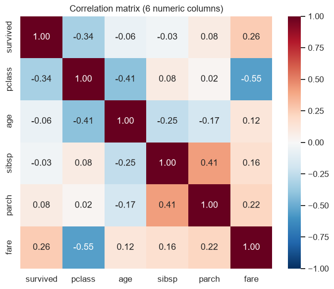

**Survival rates, computed with boolean masks:**

- **(a) By sex.** Women **74.0 %**, men **18.9 %**.
- **(b) By class.** 1st **62.6 %**, 2nd **47.3 %**, 3rd **24.2 %**.
- **(c) By sex and class.** Women: 96.7 % / 92.1 % / 50.0 % across 1st / 2nd / 3rd class. Men: 36.9 % / 15.7 % /
  13.5 %.
- **An `|` (or) mask.** "Women **or** children under 16" survived at **71.6 %**, against **16.4 %** for adult men.

Sex is the dominant factor, and class compounds it. Nearly every woman in 1st and 2nd class survived, while even
a 1st-class man had a lower survival chance than a 3rd-class woman.

**Correlation heatmap.** It covers the six specified columns only; `adult_male` and `alone` are excluded as
derived flags. All 15 off-diagonal pairs are ranked by |r| in the table above. The two strongest are:

1. **`pclass`–`fare`, r = −0.548.** A higher class *number* (a cheaper class) goes with a lower fare. This is
   the strongest relationship in the data, and it is exactly what you would expect: the ticket price largely
   *is* the class. It also warns that `fare` and `pclass` carry overlapping information.
2. **`sibsp`–`parch`, r = +0.415.** Passengers travelling with siblings or spouses also tend to travel with
   parents or children, because both columns count members of the same family groups.

For the target itself, `survived` correlates most with `pclass` (r = −0.336) and `fare` (r = +0.255).
Its linear correlation with `age` is weak (−0.064). Age matters mainly at the young end, which a straight-line
correlation cannot capture (see Chart 2).

## 5. Multivariate data story — who survived, and why?

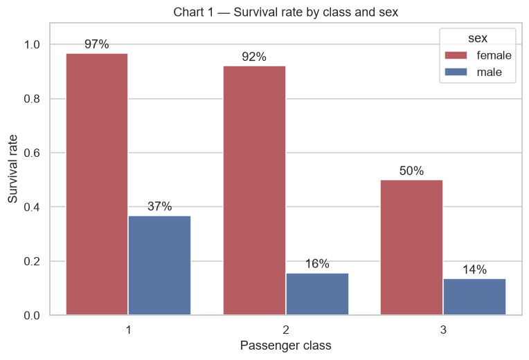

**Chart 1 interpretation.** This chart carries the main argument: **sex decided survival first, and class second**.

- **Women:** 97 % and 92 % survived in 1st and 2nd class, but only 50 % in 3rd class.
- **Men:** only 37 % survived even in 1st class, falling to 16 % and 14 % in 2nd and 3rd.

The "women and children first" loading policy explains the sex gap. Class explains the rest, because
first-class cabins were closer to the boat deck and were reached first.

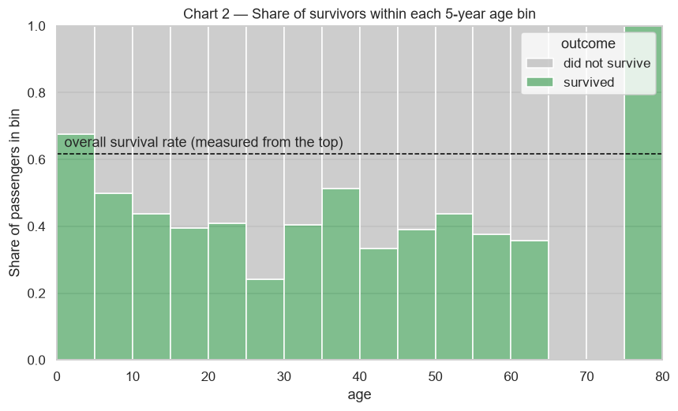

**Chart 2 interpretation.** Each bar shows the survivor share (green) within a 5-year age band. The dashed line is
the overall survival rate, read downward from the top.

- **Children stand out.** 0–5-year-olds are the only band well above average: about 68 % survived, and the
  0–12 band as a whole survived at 58 %.
- **Young adults fared worst.** The 19–30 band, which is dominated by third-class men, survived at only 32 %.
- **Older passengers.** The 65–75 bands show 0 %, and the single 80-year-old survived. These bands contain very
  few passengers, so they should not be over-read.

This is why `age` has a near-zero linear correlation with survival yet still matters: its effect is
concentrated at the youngest ages.

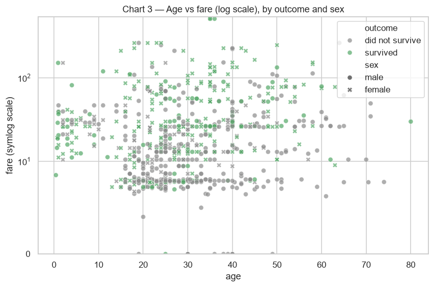

**Chart 3 interpretation.** Fare is plotted on a log scale so that cheap and expensive tickets are both visible.

- **Survivors (green) cluster in the upper band of fares.** The median fare of survivors is **26.0**, against
  **10.5** for those who died.
- **Men (circles) in the dense low-fare band below 15 are overwhelmingly grey:** 88 % of them did not survive.
- **Survivors at low fares are mostly women (crosses) or children:** 69 % of the survivors who paid under 15.

So fare and sex combine: a high fare helps, but being female helps far more at every fare level.

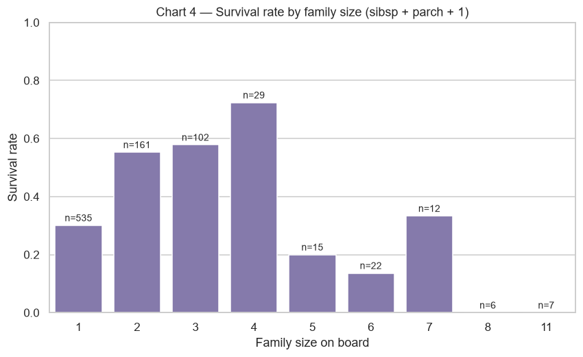

**Chart 4 interpretation.** Family size (sibsp + parch + 1) has a clear "sweet spot":

- **Alone:** passengers travelling alone (n = 535, the majority) survived at only about 30 %.
- **Small families:** families of 2–4 did best, at about 55 %, 58 % and 72 %.
- **Large families:** families of 5 or more collapsed to 0–33 %, and every member of the 8- and 11-person
  families died.

Small families likely helped each other and included women and children who were given priority. Large families
were mostly in third class (87 % of families of 5 or more) and hard to keep together. Solo travellers were
disproportionately adult men (77 %, against 60 % of all passengers).

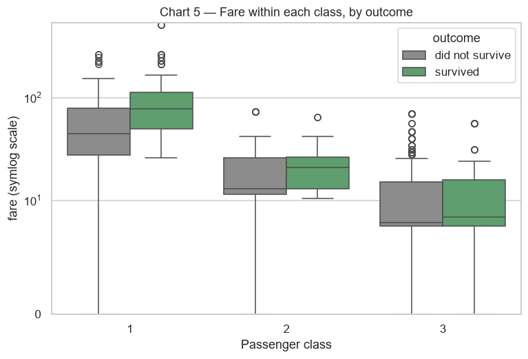

**Chart 5 interpretation.** This chart asks whether fare matters *beyond* class.

- **In 1st class, survivors paid clearly more.** The median fare was 77.34 for survivors against 44.75 for those
  who died, which suggests better (higher-deck) cabins within first class.
- **In 2nd class the gap is smaller:** 21.00 against 13.00.
- **In 3rd class there is almost none:** 8.52 against 8.05.

So fare's link with survival is mostly its link with class, plus a real within-class effect only at the top of
the market. This completes the story: **sex first, then class (with fare as its proxy), then being a young child
or part of a small family**.

## 6. Exploratory z-score check

| | mean before | std before | mean after | std after |
|---|---|---|---|---|
| `age` | 29.07 | 13.27 | 0.0000 | 1.0000 |
| `fare` | 32.10 | 49.70 | 0.0000 | 1.0000 |

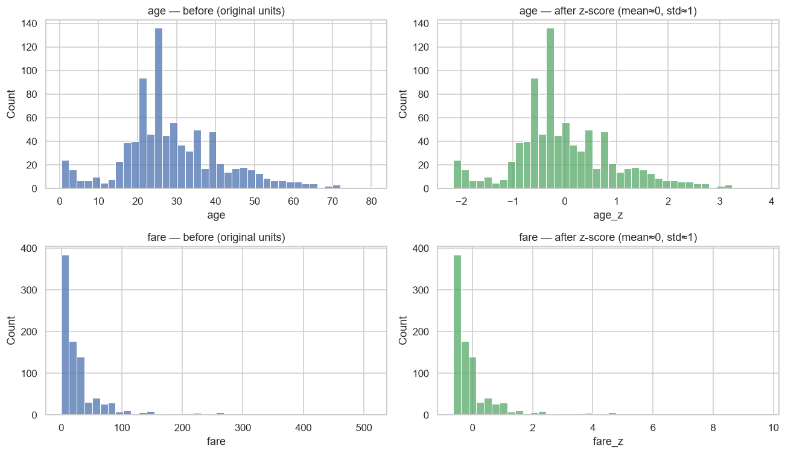

**Standardization check.** Before scaling, `age` has mean 29.07 and std 13.27, and `fare` has mean 32.10 and
std 49.70, so the two columns are on very different scales. After applying z = (x − mean) / std, **both have
mean 0.0000 and standard deviation 1.0000**.

The before/after histograms have identical shapes, because the transform only shifts and rescales the values. In
particular, `fare` stays right-skewed: standardizing does not remove skew, it only puts the columns on a common
scale.

As required, this check is EDA-only. The modeling notebook fits its own `StandardScaler` on the training split
alone.

---

# Part B — Predictive modeling (continuing from the same data)

## 7. Features and stratified split

**Feature choice.** The model uses `pclass, age, sibsp, parch, fare, sex, embarked`, the raw passenger attributes
the EDA identified as informative. The rest are left out:

- **`alive`** is excluded because it is the target written as yes/no. Using it would be pure target leakage.
- **`class`, `who`, `adult_male`, `embark_town` and `alone`** are excluded because they only re-encode columns
  already used.
- **`deck`** is excluded because it is 77 % missing.

`age` still contains 177 missing values at this point. They are imputed *inside* the pipeline.

**Why stratify.** The target is imbalanced: **61.8 % did not survive and 38.2 % survived** (after the 2 dropped
rows). A plain random 80/20 split could, by chance, put noticeably more or fewer survivors into the 178-row test
set. That would make the test metrics, especially precision, recall and F1 for the minority "survived" class,
unrepresentative and unstable between runs.

`stratify=y` forces both splits to keep the same class ratio. The table confirms it: train 61.7 / 38.3, test
61.8 / 38.2. Every model is then evaluated against the same realistic class mix it will face in practice. The
split is done **before** any preprocessing, so nothing about the test rows can influence the fitted steps.

## 8. Leakage-safe preprocessing

A `ColumnTransformer` handles each group of columns and is wrapped in a `Pipeline` with the estimator:

- **Numeric columns:** `SimpleImputer(median)` → `StandardScaler`.
- **Categorical columns:** `SimpleImputer(most_frequent)` → `OneHotEncoder(handle_unknown="ignore")`.

`fit` therefore only ever sees the training rows, and the test rows are only transformed. The same holds in
`GridSearchCV`, where the preprocessing is re-fitted inside each CV training fold.

**Leakage check.** The imputer's learned medians equal the **training-split** medians, and the scaler's learned
mean of `fare` equals the **training** mean (31.857). It does not equal the full-data mean (32.097). This
confirms that the preprocessing statistics were learned from the training rows only, and that the test rows are
only ever transformed with them.

## 9. Three classifiers and their evaluation

All three models are trained on the identical split.

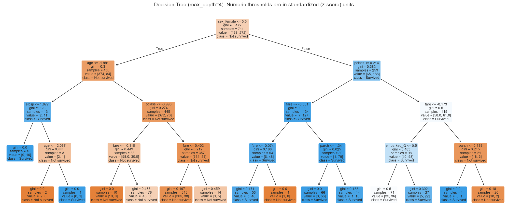

**Reading the tree.** The first split is on `sex_female`: the left branch (`sex_female <= 0.5`) holds the men.
This matches the EDA, where sex was the strongest driver.

- **Men (left branch).** The only large group predicted to survive is very young boys (`age <= −1.99` in z-units,
  i.e. about 3.5 years old or younger) with few siblings. Almost all other men are predicted "Not survived".
- **Women (right branch).** The next split is on `pclass`. Women in 1st and 2nd class (`pclass <= 0.21`) are
  predicted "Survived" with very high purity (127 of 134 training women). For 3rd-class women the outcome is
  close to a coin flip (58 vs 61), and the tree uses fare and `parch` to separate them. Cheaper fares and small
  families survive more; large families do not.

`max_depth=4` was chosen deliberately. It keeps the tree readable and limits overfitting, because an
unrestricted tree would memorise the 711 training rows. Numeric thresholds are shown in standardized units
because the tree sees the output of the pipeline's `StandardScaler`.

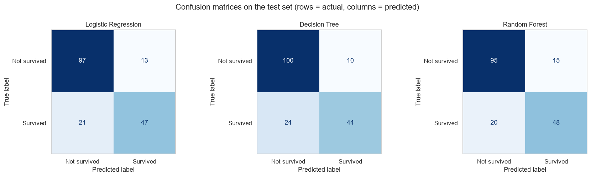

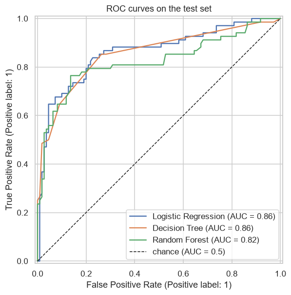

**Evaluation on the 178-row test set.**

| Model | Accuracy | Precision | Recall | F1 | AUC |
|---|---|---|---|---|---|
| Logistic Regression | 0.809 | 0.783 | 0.691 | 0.734 | **0.861** |
| Decision Tree (depth 4) | 0.809 | **0.815** | 0.647 | 0.721 | 0.856 |
| Random Forest (default, 300 trees) | 0.803 | 0.762 | **0.706** | 0.733 | 0.824 |

**The three untuned models are very close.**

- **Logistic Regression** ranks passengers best: it has the highest AUC, 0.861.
- **Decision Tree** is the most conservative. It has the highest precision (0.815), but it misses the most
  survivors: 24 false negatives, recall 0.647.
- **Default Random Forest** catches the most survivors (recall 0.706, 20 false negatives), but it has the most
  false alarms (15) and the lowest AUC.

The untuned forest grows its trees to full depth and overfits the small training set, which is why tuning is
worth doing (section 7).

**Every model makes more false negatives than false positives.** Survivors are the minority class, which
motivates the imbalance experiment below.

## 10. Imbalance handling

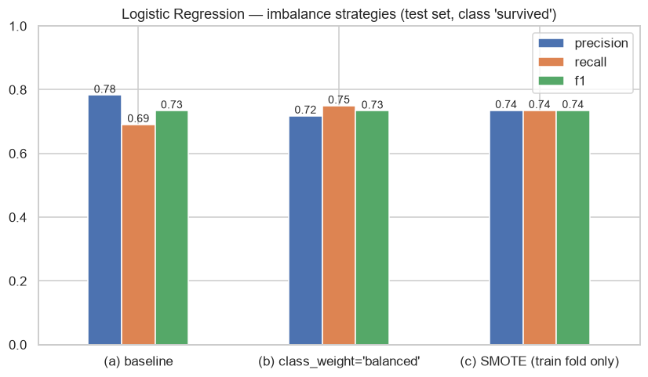

**Class balance.** The training split has 439 non-survivors against 272 survivors (61.7 % / 38.3 %). SMOTE
oversampled only the training data, to 439 / 439. The test set keeps its real 110 / 68.

| Variant | Precision | Recall | F1 |
|---|---|---|---|
| (a) baseline | **0.783** | 0.691 | 0.734 |
| (b) `class_weight='balanced'` | 0.718 | **0.750** | 0.734 |
| (c) SMOTE (train only) | 0.735 | 0.735 | **0.735** |

**Conclusion.** Both balancing strategies do what they should: they shift the decision boundary towards the
minority class.

- **Recall rises**, from 0.691 to 0.750 with `class_weight` and to 0.735 with SMOTE, so 4 more survivors are
  caught with `class_weight`.
- **Precision falls** by the same amount, so **F1 stays essentially unchanged** at about 0.734. SMOTE is only
  0.001 ahead, which is noise on a 178-row test set.

The imbalance here is only moderate (38 / 62), so no strategy produces a real F1 gain: they trade precision for
recall. **The strategy that worked best is `class_weight='balanced'`.** It gives the largest recall gain
(+5.9 points) at no F1 cost, needs no synthetic data and no extra library, and cannot introduce oversampling
artefacts. If catching every possible survivor matters more than false alarms, it is the one to use. SMOTE
reaches a similar result with more machinery.

## 11. Hyperparameter tuning (GridSearchCV + OOB)

Grid: `n_estimators` ∈ {100, 200, 400}, `max_depth` ∈ {4, 6, 8, None}, `max_features` ∈ {sqrt, log2, None},
using the estimator `RandomForestClassifier(oob_score=True, random_state=42)`.

**Tuning result.**

- **Search space.** 36 combinations × 5 stratified folds, scored by **F1**. F1 balances precision and recall on
  the minority class, which accuracy alone would not.
- **Best parameters:** `n_estimators=400`, `max_depth=8`, `max_features=None`, with a mean CV F1 of **0.772**
  (std 0.004).
- **OOB score:** **0.833**. That is the accuracy of the refitted best forest on the training rows each tree did
  *not* see in its bootstrap sample, a built-in validation estimate that needs no extra data.

**Capping `max_depth` at 8 is what helped.** It stops the trees from memorising the training set. All of the
top 8 combinations use depth 8 or unlimited, and depth 8 wins.

**On the test set** the tuned forest improves on the default forest in every metric except recall (which is
unchanged):

- accuracy 0.803 → **0.831**
- precision 0.762 → **0.828**
- F1 0.733 → **0.762**
- AUC 0.824 → 0.841

Its test accuracy (0.831) agrees closely with the OOB estimate (0.833), which suggests the model generalises as
expected rather than having been lucky on this split.

## 12. Regression side-task — predicting `fare`

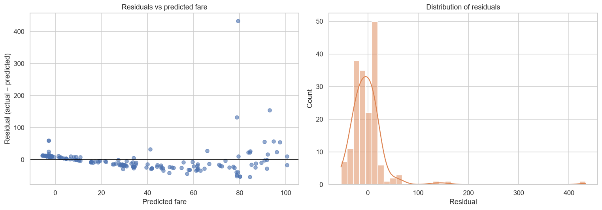

**Regression results.**

| MAE | RMSE | R² | Adjusted R² |
|---|---|---|---|
| 21.14 | 41.75 | 0.347 | 0.312 |

- **Fit.** The model explains about **35 %** of the variance in fare. Adjusted R² (n = 178 test rows,
  p = 9 predictors after one-hot encoding) is slightly lower at 0.312, which penalises the extra predictors.
- **Coefficients.** `pclass` dominates: one standard deviation towards a cheaper class lowers the predicted fare
  by about 27. Larger families (`parch`, `sibsp`) and boarding at Cherbourg raise it.
- **Error measures.** RMSE is about twice the MAE, a sign that a few very large errors dominate. These are the
  extreme first-class fares, such as 512.33.

**Heteroscedasticity: yes, clearly present.** The residuals do **not** form an even band around zero; they fan
out as the prediction grows.

- **Residual spread by quartile of predicted fare:** 10.4, 9.3 and 12.2 for the three lower quartiles, then
  **78.1** for the top quartile.
- **Why.** Cheap third-class fares are all similar, while first-class fares range from about 25 to 512, and a
  linear model cannot capture that growing spread.
- **Other warning signs.** The residuals also show a curved pattern: positive at low predictions, negative in
  the middle. The model even predicts slightly *negative* fares for some third-class passengers. Both show that
  a straight-line model is a poor fit for this skewed target.

Modelling `log(fare)`, or using a tree-based regressor, would be the natural next step. It was not required
here, so the plain multivariate linear regression is reported as asked.

## 13. Final model comparison

The table has **two separate metric groups**. The classification columns apply only to the `survived`
classifiers; the regression columns apply only to the `fare` model.

| Model | Accuracy | Precision | Recall | F1 | AUC | | MAE | RMSE | R² | Adj. R² |
|---|---|---|---|---|---|---|---|---|---|---|
| | *Classification (target: survived)* | | | | | | *Regression (target: fare)* | | | |
| Logistic Regression | 0.809 | 0.783 | 0.691 | 0.734 | **0.861** | | — | — | — | — |
| Decision Tree (depth 4) | 0.809 | 0.815 | 0.647 | 0.721 | 0.856 | | — | — | — | — |
| Random Forest (default) | 0.803 | 0.762 | 0.706 | 0.733 | 0.824 | | — | — | — | — |
| **Random Forest (tuned)** | **0.831** | **0.828** | **0.706** | **0.762** | 0.841 | | — | — | — | — |
| Linear Regression (fare) | — | — | — | — | — | | 21.14 | 41.75 | 0.347 | 0.312 |

**How to read this table.** It has two separate metric groups. The **classification** columns (accuracy,
precision, recall, F1 and AUC, all between 0 and 1, higher is better) apply to the four `survived` classifiers.
The **regression** columns (MAE and RMSE in fare units where lower is better, and R² / adjusted R² where higher
is better) apply only to the `fare` model. The two groups measure different things on different scales and are
not comparable with each other; "—" marks metrics that do not apply to a model.

### Recommendation — which classifier to deploy

**Deploy the tuned Random Forest.**

- **Best on the core metrics.** It has the best test accuracy (**0.831**), precision (**0.828**) and F1
  (**0.762**) of all the classifiers. It beats the next-best F1 (Logistic Regression, 0.734) by almost 3 points
  while producing the fewest false alarms (10, tied with the Decision Tree).
- **Trustworthy generalisation.** Its OOB estimate (0.833) and cross-validated F1 (0.772, std 0.004) agree with
  the test result, so the performance is stable rather than a lucky split.
- **Where Logistic Regression still wins.** It keeps a slightly higher AUC (0.861 against 0.841), so it ranks
  passengers by probability a little better. It is also more interpretable, and would be the better choice if
  calibrated probabilities or explainability mattered more than the final yes/no decision.
- **If recall is the priority.** The forest could additionally be trained with `class_weight='balanced'`, as
  section 6 showed.

## 14. Saved pipeline

**Saved artifact.** `models/titanic_survival_pipeline.joblib` holds the **complete fitted pipeline**:
`ColumnTransformer` (median imputer + scaler, most-frequent imputer + one-hot encoder) → tuned
`RandomForestClassifier`. It is not the bare estimator. After `joblib.load`:

1. It reproduces the in-memory predictions exactly on all 178 raw test rows (checked with `assert`), with the
   same accuracy of 0.831.
2. It scores brand-new passengers given as **raw values**: plain `"female"`/`"male"` strings, fares in original
   units, and even a missing `age` (`NaN`), which the saved imputer fills with the training median. No manual
   preprocessing is needed.

The predictions also make sense:

- A 1st-class woman: **p = 0.998**.
- A 24-year-old 3rd-class man travelling alone: **p = 0.05**.
- A 4-year-old boy travelling with family: **p = 0.82**. This is the "children first" pattern from the EDA.

Reload it yourself:

```python
import joblib, pandas as pd
pipe = joblib.load("models/titanic_survival_pipeline.joblib")
raw = pd.DataFrame([{"pclass": 3, "age": None, "sibsp": 0, "parch": 0, "fare": 7.25,
                     "sex": "male", "embarked": "S"}])
pipe.predict(raw), pipe.predict_proba(raw)[:, 1]


interpretations are given  on  ReadME docs and each  section , but not plots
```
